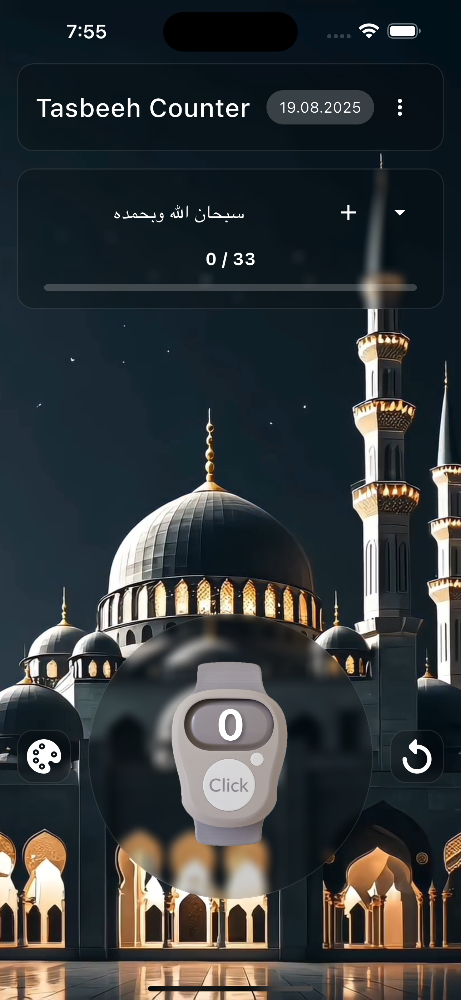
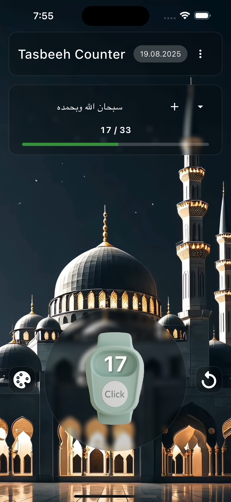
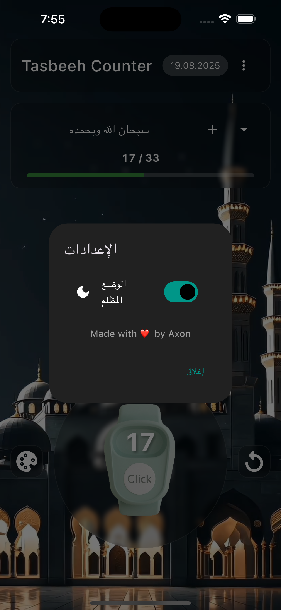
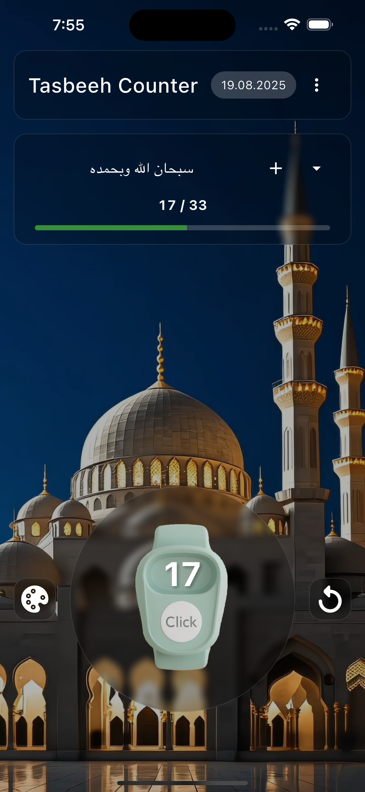
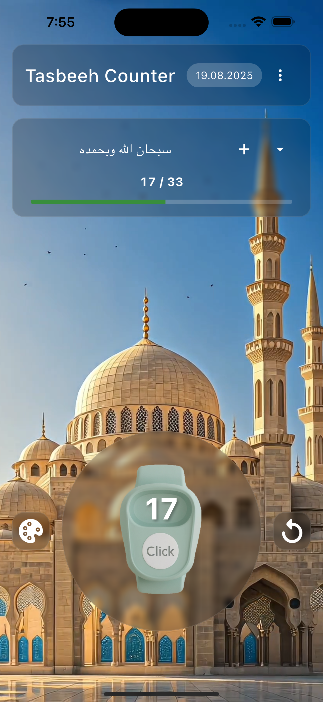
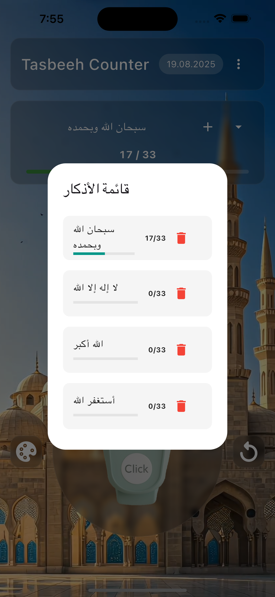
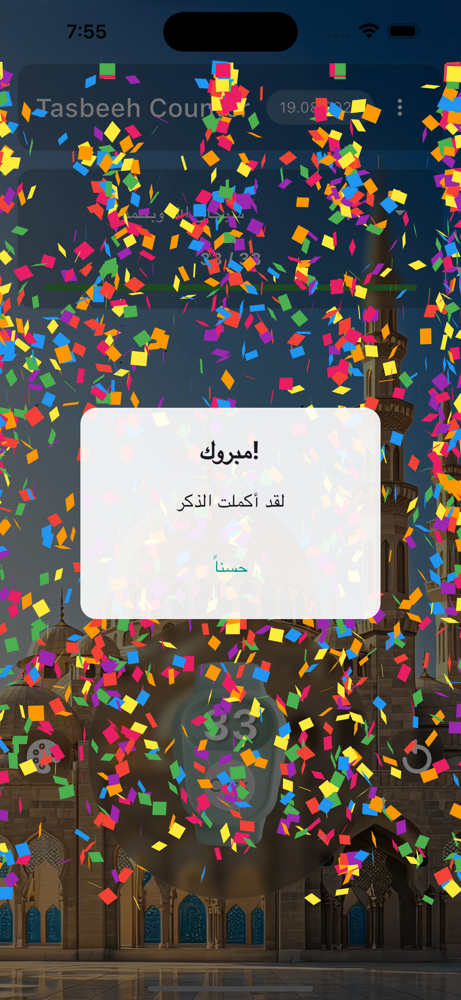
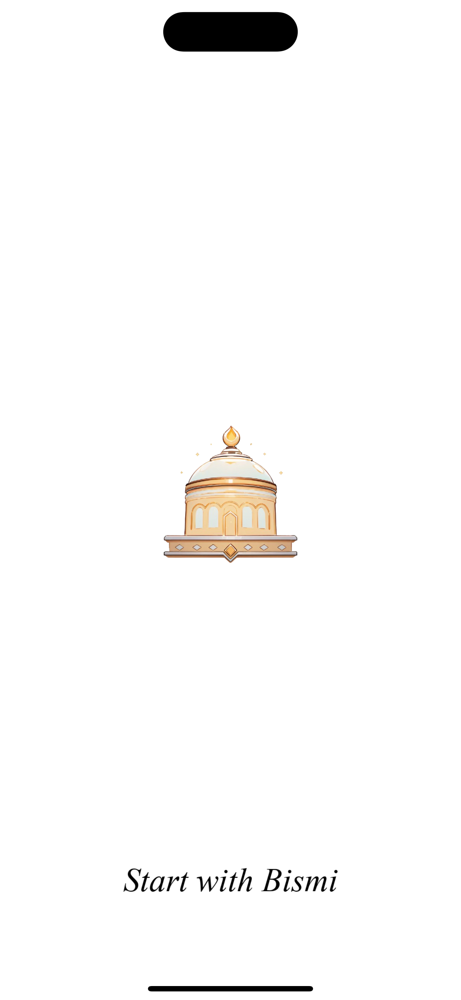
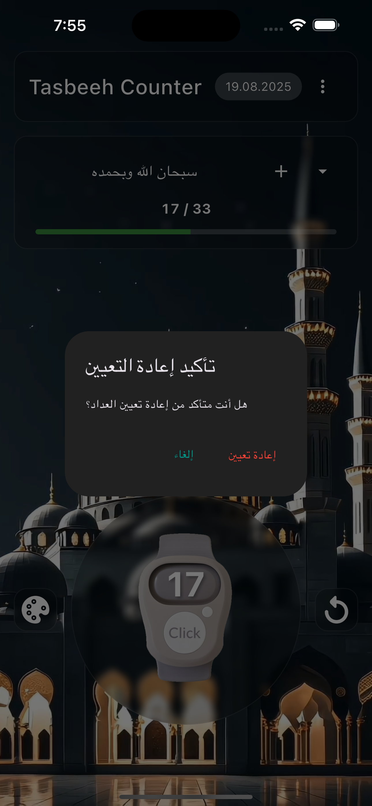

### Athkar – Digital Tasbeeh Counter

An elegant, responsive Flutter app for daily dhikr. Choose a dhikr, set a target, tap the digital counter, and enjoy subtle animations, progress, and a celebratory confetti effect when you reach your goal. The app remembers your progress locally and supports automatic day/night themes with a smooth video transition.


### Features

- **Dhikr selection and targets**: Pick from saved adhkar or add your own with a target count.
- **Animated digital counter**: Smooth image transitions and number flip on every tap.
- **Progress indicator**: See progress toward your target at a glance.
- **Confetti celebration**: Visual feedback when the target is reached.
- **Auto day/night theme**: Theme switches based on time, with a video transition.
- **Local persistence**: Dhikr list, progress, and theme state saved via `SharedPreferences`.
- **State management**: Built with `GetX` for reactive UI and simple navigation.

### Tech stack

- Flutter (Dart >= 3.1.3)
- GetX, Shared Preferences, Video Player, Confetti, Animated Flip Counter, Google Fonts, Audioplayers

### Screenshots

<p>
  
  
  
  
  
  
  
  
  
  
  
  
  
  
  
  
  
  
</p>

### Getting started

1. Prerequisites

- Flutter SDK installed and configured
- Xcode (iOS) and/or Android Studio (Android) toolchains

2. Install dependencies

```bash
flutter pub get
```

3. Run

```bash
# Android
flutter run -d android

# iOS (first run may take longer; ensure a simulator or device is available)
flutter run -d ios

# Web (optional)
flutter run -d chrome
```

If you run iOS on a physical device for the first time and encounter CocoaPods issues:

```bash
cd ios && pod install --repo-update && cd ..
```

### Project structure (key files)

```text
lib/
  main.dart                              # App entry; sets up themes and DI
  var.dart                                # Shared layout helpers and assets lists
  models/dhikr_item.dart                  # Dhikr data model (JSON serializable)
  data/datasources/local_storage.dart     # SharedPreferences read/write
  presentation/
    controllers/dhikr_controller.dart     # GetX controller: state, logic, theme video
    screens/
      splash_screen.dart                  # Simple splash, routes to Home
      home_screen.dart                    # Main UI (video bg, header, selector, counter)
```

Assets are declared in `pubspec.yaml` under `flutter.assets` and include backgrounds, clicker images, splash assets, and the theme transition video.

### Configuration

- Update the app name, icons, and identifiers as needed in the platform folders (`android/`, `ios/`, `macos/`, etc.).
- To change default adhkar or UI behavior, see `presentation/controllers/dhikr_controller.dart` and `presentation/screens/home_screen.dart`.

### Acknowledgements

- Packages: `get`, `shared_preferences`, `video_player`, `confetti`, `animated_flip_counter`, `google_fonts`, `audioplayers`.

### License

This project is provided as-is. Add your preferred license here.
